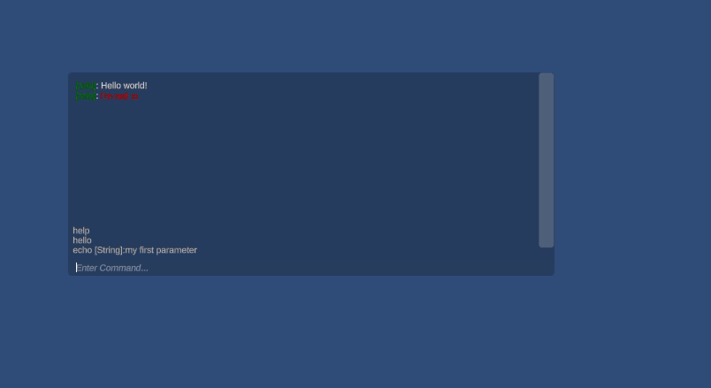
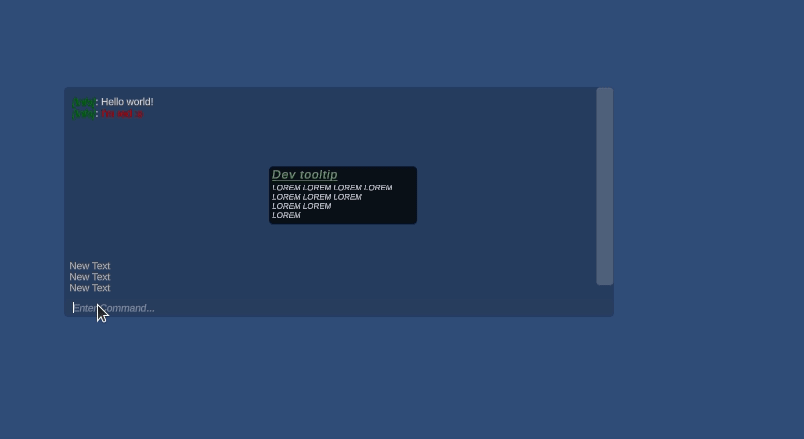

# Needle
Open source Unity Console  

**Projekt jest w czasie budowy, dokument markdown jest napisany z myślą o prezentacji projektu uczelni**  

### W pigułce - co to za projekt?

Chcę stworzyć otwarto-źródłową konsolę dla silnika do gier Unity. Jest mnóstwo tutoriali jak taką zrobić, jednak w nich zawsze brakuje mi:
* Modyfikalności - jakkolwiek nie po polsku to brzmi, to chcę by konsola nad którą pracuje była bardziej frameworkiem niż tylko gotową konsolą, żeby w paczce którą dev pobiera były narzędzia, moduły i jakaś przykładowa konsola, z której może korzystać ale też może się po prostu na niej bazować tworząc własną konsolę korzystając z modułów/narzędzi które dodałem i tworząc swoje własne!
* Parser stringów - większość konsol dostępnych do Unity (szczególnie darmowych) potrzebuje określonego parsera dla danych "nie konwertowalnych na stringa" klas (np. klas które programista tworzy dla projektu) - Needle takich nie potrzebuje!
* Używa wiele fajnych algorytmów, które sprawiają że działa po prostu lepiej ;)



**Co jest interesującego z punktu widzenia algorytmów/informatyki?**
* [Rejestrowanie metod](#rejestrowanie-metod)
* [Parser stringów - klas złożonych](#parser-stringów---klas-złożonych)
* [Sugestie](#sugestie)
* [Wysoka modyfikowalność konsoli](#wysoka-modyfikowalność-konsoli)

### Rejestrowanie metod

Każda metoda, którą chcemy rejestrować musi mieć atrybut "ConsoleCommand":

```csharp
[ConsoleCommand("hello", "hello dear dev!")]
public static string HelloWorld()
{
    Debug.Log("Hello world!" );
    return "Success";
}
```

Ten atrybut wskazuje naszej konsoli by zarejestrować daną metodę. Rejestrowanie statycznych metod odbywa się automatycznie. Zabawa jest z metodami, które nie są statycznie. Przecież, żeby je wykonać, te klasy muszą zostać stworzone - w Unity zazwyczaj tworzymy klasy przypisując je do GameObjectów. Z tego rozwiązania jestem najmniej dumny, jednak działa i nie widziałem lepszej możliwości by rejestrować metody. Na starcie (lub wtedy gdy programista chce by dany objekt rejestrować) po prostu o tym informuje - wysyła prośbę o rejestrację do rejestratora:
```csharp
CommandRegistry.RegisterInstance(this);
```
W oczywisty sposób również należy wyrejestrować objekt gdy np. go zniszczymy (np. w metodzie onDestroy):  
```csharp
CommandRegistry.UnregisterInstance(this);
```
W ten sposób się rejestruje gdy uzna to za konieczne. Nie podoba mi się to rozwiązanie i zastanawiałem się jak robią to frameworki networkingowe jak np. Mirror, które rejestrują objekty od po atrybutach bez konieczności wywoływania żadnych funkcji typu RegisterSelf. Okazało się że najprawdopodniej korzystają z `` IL Weaving`` i edytują zbuildowany kod.
Uznałem że moje rozwiązanie jest wystarczające dla tego projektu, a w dodatku daje programiście wolną rękę kiedy ma rejestrować swój objekt.  
Jednak dla ułatwienia pracy, dodałem bazową klasę, która rozszerza ``MonoBehaviour`` (skrypty runtime dla Unity) i rejestruje/wyrejestrowywuje objekt automatycznie na start lub gdy jest zniszczony:

[NeedleBehaviour](Console/Core/NeedleBehaviour.cs)
```csharp
namespace NeedleAssets.Console.Core
{
    public class NeedleBehaviour : BonoBehaviour
    {
        protected override void OnStartAndEnable() => CommandRegistry.RegisterInstance(this);
        

        public void OnDisable() => CommandRegistry.UnregisterInstance(this);
    }
}
```

Rozszerza [BonoBehaviour](Console/Utilities/BonoBehaviour.cs), abstrakcyjną klasę, która gwarantuje, by metoda ``OnEnable`` została wywołana po metodzie ``Start`` - okazało się, że nie zawsze mamy taką gwarancję, co mnie zdziwiło *(nie tylko mnie, tu post [UnityDiscussions](https://discussions.unity.com/t/we-have-awake-onenable-and-start-why-only-ondisable-and-ondestroy/900067/15))*.

Metody statyczne są rejestrowane automatycznie, bo mogą być wywołane bez instancji objektu.  

Dodatkowo programista ma do wyboru parę dodatkowych atrybutów i sprecyzowanie czy komenda jest tylko dla developera *(co to oznacza może określić programista, ale domyślnie komendy dla programisty działają tylko w edytorze Unity)*.

```csharp
[ConsoleCommand("echo", "hello dear dev!", false)]
[ParamDescriptor("some test description")]
[ParamIdentifier("my first parameter")]
public string Echo(string param)
{
    return param;
}
```

``ConsoleCommand(nazwa komendy, opis komendy, czy jest tylko dla dewelopera)``
``ParamDescriptor(opisy parametrów)`` - bierzemy tylko tyle opisów ile jest parametrów, co ważne nie jest to wymagany atrybut - jego brak, lub niewystarczająca ilość opisów względem parametrów będzie oznaczać po prostu brak opisu parametru *(np. w metodzie help)*.  
``ParamIndentifier(nazwy parametrów)`` - nazwy parametrów, analogicznie do opisów, jeśli jest inna niż sprecyzowana "w kodzie", również nie wymagany, gdy dla danego parametru nie występuje oznaczać to będzie że parametr nazywa się tak jak widzimy to w kodzie.

Funkcja echo:
* Nazywa się echo
* Opis: hello dear dev
* Jest ogólnego dostępu
* Ma jeden parametr, w kodzie nazywa się param. Dla gracza będzie widoczny pod nazwą "my first parameter", a jego opis będzie brzmieć "some test description".

### Parser stringów - klas złożonych

Przy wywoływaniu komendy walidujemy ją. Sprawdzamy czy:
* Dana komenda istnieje
* Ma wystarczająco dużo argumentów
* Ma poprawne argumenty

Co jeśli parametrami funkcji są jakieś struktury danych zamiast typowych danych typu int/string itd?  
Większość konsol w tym momencie oczekiwałaby jakiegoś specjalnego parsera dla klasy, ja jednak podszedłem do problemu inaczej, nasz runner wykonuje następującą czynność:
1. Czy jestem w stanie sparsować string w typ parametru? Jeśli tak to odłóż parametr na koniec listy/kolejki parametrów, weź kolejny parametr i wykonaj krok 1. Jeśli nie idź do kroku 2.
2. Czy klasa parametru ma konstruktor z atrybutem ``CommandConstructor``? Jeśli tak to weź parametry z tego konstruktora i wsuń w parametry do sprawdzenia - na start kolejki. Weź z tej kolejki oczekujących parametrów do sprawdzenia kolejny parametr (pierwszy z konstruktora) i wykonaj krok 1. Jeśli nie to idż do kroku 3.
3. Weź konstruktor z największą ilością parametrów oraz weź parametry z tego konstruktora i wsuń w parametry do sprawdzenia - na start kolejki. Weź z tej kolejki oczekujących parametrów do sprawdzenia kolejny parametr (pierwszy z konstruktora) i wykonaj krok 1.

Dzięki temu dostaniemy listę parametrów konwertowalnych ze stringa, dzięki którym będzie można stworzyć klasy.
Dla przykładu [TestClass](Examples/Example%201/TestClass.cs):
```csharp
namespace NeedleAssets.Examples.Example_1
{
    public class TestClass
    {
        public Vector3 Position;
        public string Name;
        public int Age;

        public TestClass(Vector3 pos, string name, int age)
        {
            Position = pos;
            Name = name;
            Age = age;
        }
    }
}
```

Oraz funkcja [TestClass](Examples/Example%201/Test.cs):

```csharp
[ConsoleCommand("test_class", "Test command for parsing classes", true)]
public string TestClass(TestClass testClass)
{
    return $"testClass.Position = ({testClass.Position.x}, {testClass.Position.y}, {testClass.Position.z}), testClass.Name = {testClass.Name}, testClass.Age = {testClass.Age}";
}
```

Dla tej funkcji będziemy oczekiwać następujących argumentów:
* ``double x`` - pierwszy parametr konstruktora z 3 argumentami *(najwięcej)* ``Vector3`` - pierwszego parametru konstruktora klasy ``TestClass``
* ``double y`` - drugi parametr konstruktora z 3 argumentami *(najwięcej)* ``Vector3`` - pierwszego parametru konstruktora klasy ``TestClass``
* ``double z`` - trzeci parametr konstruktora z 3 argumentami *(najwięcej)* ``Vector3`` - pierwszego parametru konstruktora klasy ``TestClass``
* ``string name`` - drugi parametr konstruktora klasy ``TestClass``
* ``int age`` - trzeci parametr konstruktora klasy ``TestClass``

I następnie walidujemy argumenty jak dla zwykłej funkcji, która by miała takie "generyczne parametry" - dla każdego argumenty w formie string konwertujemy go na dany typ - jeśli błąd konwersji to zwracamy błąd i informujemy użytkownika o błędzie.



### Sugestie

Do sugestii wykorzystuję drzewa tri. W sumie to u Pana na zajęciach dowiedziałem się o tej strukturze i gdy Pan powiedział, że typowym use casem są sugestie, to wróciłem do domu i od razu stworzyłem prosty koncept, który udowodnił Pana słowa! (Nota bene tak brzmiała modyfikacja, która na laborkach dostaliśmy ;)).  
W tym momencie sugestie działają, w oparciu o drzewa tri. Jednak nie ukrywam że pisałem to przy nawale rzeczy (czyli dość niedawno, bo zbliża się sesja) i uważam że czytelność/code quality tej sekcji jest najgorszy w projekcie. Mimo to uważam że jest świetny i działający przykład wykorzystania drzew tri!  
[Drzewo Tri](Console/Core/Registry/TreeTri)  
Przy każdej zmianie tekstu, sprawdzamy czy zmieniła się ostatnia literka, jeśli tak to idziemy do odpowiedniego dziecka, lub cofamy się do rodzica, jeśli nie to szukamy odpowiedniego słowa od roota! Działa płynnie, lecz wygląda póki co okropnie - to sekcja do zdecydowanego refactoringu.  
[Suggestions](Console/UI/UserInput/Suggestions)

Po wpisaniu czegoś automatycznie wyświetla się podpowiedź. Zaznaczyć ją można strzałkami na klawiaturze i wybrać, by się automatycznie uzupełniła tabem.  
Gdy klikamy strzałki na start to wybieramy ostatnie komendy (jeśli jakieś były już wpisane).

### Wysoka modyfikowalność konsoli

Konsola którą pokazuje jest stworzona za pomocą [prostego skryptu](Console/Needle.cs):
```csharp
[...]
namespace NeedleAssets.Console
{
    public class Needle : NeedleConsole<MessageType>
    {
        [SerializeField] private ScrollRect outputScrollRect;
        
        protected override Dictionary<MessageType, Color> TypeToColors => new ()
        {
            {MessageType.Info, NeedleColors.Colors[0]},
            {MessageType.Warning, NeedleColors.Colors[1]},
            {MessageType.Error, NeedleColors.Colors[2]},
            {MessageType.Debug, NeedleColors.Colors[3]},
            {MessageType.UserInput, NeedleColors.Colors[4]},
        };

        protected override MessageType Info => MessageType.Info;
        protected override MessageType Warning => MessageType.Warning;
        protected override MessageType Error => MessageType.Error;
        protected override MessageType Debug => MessageType.Debug;
        protected override MessageType Input => MessageType.UserInput;

        protected override IEntryLogger<MessageType> MessageLogger() => new NeedleEntryLogger<MessageType>();
        protected override void _onOutputChanged()
        {
           
        }
    }
}
```

Co deweloper może zmienić?  

Typy wiadomości - odpowiada za to Enum ``MessageType``, klasa NeedleConsole jest generyczną bazową konsolą z generycznym parametrem typu Enum.  

Kolor wiadomości - odpowiada za to TypeToColors, kolory mogą być jakie się chce, jeśli będzie ich za mało to konsola bierze kolor pierwszego klucza.  

Typy dla wiadomości Info, Warning, Error, Debug, Input - konsola musi wiedzieć do jakich typów wiadomości, które programista wybierze ma przypisać zwracane przez nią odpowiedzi - np. po sukcesie info, po błędzie error, lub po prostu przy wywołaniach typu ``NeedleLog``/``NeedleDebug`` które printują określony typ wiadomości. Defaultowo zerowa wartość enuma.  

W jaki sposób wiadomości mają być wypisywane - odpowiada za to ``IEntryLogger<Enum>``, który może być napisany całkowicie na nowo przez programistę - bo przecież ktoś może chcieć widzieć godzinę zamiast typu, a ktoś może chcieć widzieć same stringi w konsoli! (Podobnie już działa też wyświetlanie sugestii, ale jeszcze nie dodałem ich do konstruktora - chcę najpierw zrobić refactoring i przemyśleć czy nie opłaca się ich obu zastąpić jednym skryptem). [EntryLogger](Console/UI/Entries/IEntryLogger.cs), [ParameterLogger](Console/UI/UserInput/Parameters/IParameterLogger.cs).  

W praktyce stworzenie "własnej konsoli" jest banalne i jest kwestią przysłonięcia paru metod, co zrobi każdy nawet początkujący programista.  


### Słowa kończące

To mój projekt w pigułce, nie chcę zabierać więcej cennego czasu, ale jeśli miałby Pan jakieś pytania lub chciałby przetestować, to oczywiście byłbym bardziej niż szczęśliwy!  
Planuję dodać (już jest prototyp jak pewnie widać na nagraniach) tooltip, po najechaniu na jakiś log z komendy lub przekierowanie do miejsca w kodzie (podobnie jak to ma miejsce w edytorze Unity).  
Do zrobienia mam jeszcze mnóstwo, ale to już moje zadanie na wakacje, pomysły mam są one realne *(póki co)* do zrealizowania.  

W każdym razie dziękuję za laborki z Panem, na pewno zobaczymy się w przyszłym semestrze (nie wiem czy Pana to ucieszy ;)), oraz dziękuję że chciało Panu się czytać moje wypociny do końca!  
Pozdrawiam serdecznie  
Marcel Marusiak
